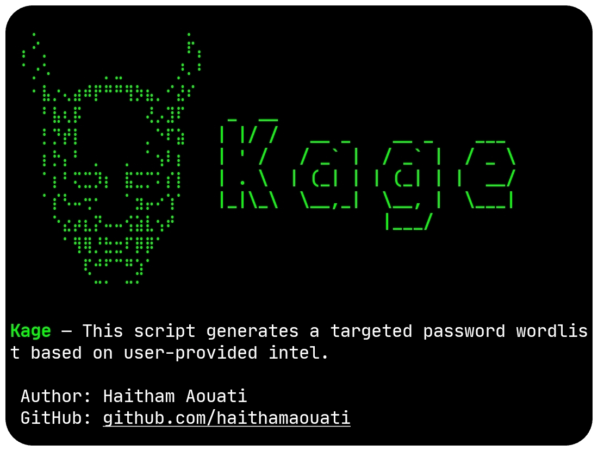

# Kage
This script generates a targeted password wordlist based on user-provided intel.



## Install

To use the Kage script, follow these steps:

1. Clone the repository:

    ```
    git clone https://github.com/haithamaouati/Kage.git
    ```

2. Change to the Kage directory:

    ```
    cd Kage
    ```
    
3. Change the file modes
    ```
    chmod +x kage.sh
    ```
    
5. Run the script:

    ```
    ./kage.sh
    ```

## Usage

Usage: `./kage.sh --help`

This script generates a targeted password wordlist based on user-provided intel.

Prompts include:
 - Name, birthdates, pets, kids, partner, company
 - Optional keywords
 - Toggles for leetspeak, capitalization, numeric suffixes, separators

## Environment
- Tested on [Termux](https://termux.dev/en/)

## Disclaimer
> [!WARNING]
> We are not responsible for any misuse or damage caused by this program. use this tool at your own risk!

## License

Kage is licensed under [WTFPL license](LICENSE).
